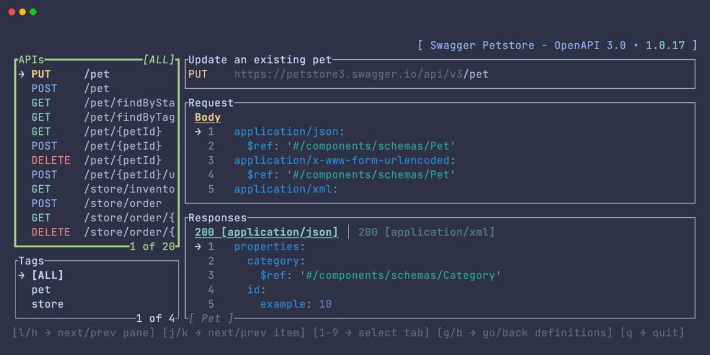

# openapi-tui

[](https://github.com/zaghaghi/openapi-tui/actions)

Terminal UI to list, browse and run APIs defined with OpenAPI v3.0 spec.


# Usage
```bash
❯ openapi-tui --help
This TUI allows you to list and browse APIs described by the openapi specification.

Usage: openapi-tui --input <PATH>

Options:
  -i, --input <PATH>  Input file or url, in json or yaml format with openapi specification
  -h, --help          Print help
  -V, --version       Print version
```

## Examples
```bash
# open local yaml file
❯ openapi-tui -i examples/stripe/spec.yml

# open local json file
❯ openapi-tui -i examples/petstore.json

# open remote file
❯ openapi-tui -i https://raw.githubusercontent.com/github/rest-api-description/main/descriptions-next/api.github.com/api.github.com.yaml
```
# Demo


## Nested Components


## Fullscreen


## Webhooks


## Filter


# Installation
Install from source:
```bash
❯ cargo install openapi-tui
```
Or download pre-built artifact from release page.

## Distro Packages

<details>
  <summary>Packaging status</summary>

[](https://repology.org/project/openapi-tui/versions)

</details>

### Arch Linux

You can install using `pacman` as follows:

```bash
❯ pacman -S openapi-tui
```

### NixOS

You can install the `openapi-tui` package directly with the following command:

```bash
nix profile install github:zaghaghi/openapi-tui
```

You can also install `openapi-tui` by adding it to your `configuration.nix` file.

```nix
# flake.nix

{
  inputs.openapi-tui.url = "github:zaghaghi/openapi-tui";
  # ...

  outputs = {nixpkgs, ...} @ inputs: {
    nixosConfigurations.<your-hostname> = nixpkgs.lib.nixosSystem {
      specialArgs = { inherit inputs; }; # this is the important part
      modules = [
        ./configuration.nix
      ];
    };
  }
}
```

Then, add `openapi-tui` to your `configuration.nix`

```nix
# configuration.nix

{inputs, pkgs, ...}: {
  environment.systemPackages = with pkgs; [
    inputs.openapi-tui.packages.${pkgs.system}.openapi-tui
  ];
}
```


# Keybindings

| Key | Action|
|:----|:-----|
| `→`, `l`| Move to next pane |
| `←`, `h` | Move to previous pane |
| `↓`, `j` | Move down in lists |
| `↑`, `k` | Move up in lists |
| `1...9` | Move between tabs |
| `f` | Toggle fullscreen pane|
| `g` | Go in nested items in lists|
| `/` | Filter apis|
| `Backspace`, `b` | Get out of nested items in lists|


# Features
- [X] Viewer
- [X] OpenAPI v3.1
- [X] Display Webhooks
- [X] Display Info and Version
- [X] Search #12
- [ ] Display Key Mappings in Popup
- [ ] Execute 
- [ ] Remote API specification
- [X] Merge Parameters Based on `in`
- [X] Pane Fullscreen Mode
- [X] Nested Components
- [X] Status Line
- [ ] Cache Schema Styles
- [ ] Read Spec from STDIN
- [ ] Command Line
